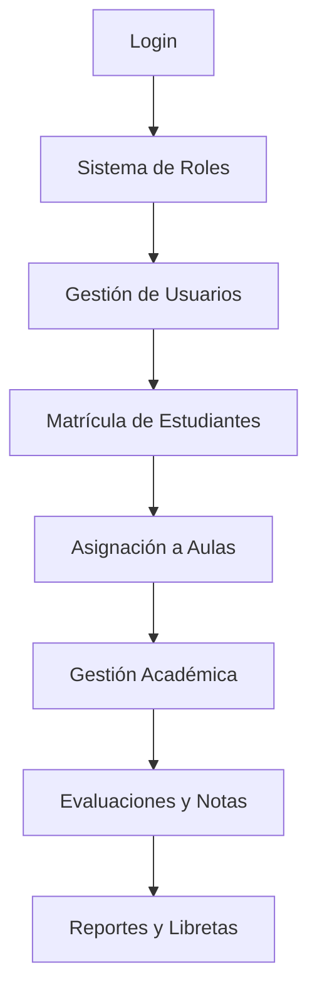

# 📚 API NIDO PRO - Documentación Completa

## 🌐 Información General

- **Base URL:** `http://localhost:3000/api/v1` (desarrollo) / `https://awsnidopr.up.railway.app/api/v1` (producción)
- **Autenticación:** Bearer Token (JWT)
- **Formato de respuesta:** JSON
- **Documentación Swagger:** `/api` (disponible en desarrollo)

## 🏗️ ARQUITECTURA DEL SISTEMA

### Estructura General del Proyecto

**Nido Pro** es un sistema de gestión educativa completo que maneja todos los aspectos de una institución educativa desde la matrícula hasta las calificaciones. El sistema está construido con:

- **Backend:** NestJS con TypeScript
- **Base de Datos:** PostgreSQL con TypeORM
- **Autenticación:** JWT con roles diferenciados
- **Validaciones:** Class-validator para DTOs
- **Documentación:** Swagger automática

### Flujo Principal del Sistema



---

## 🔐 AUTENTICACIÓN Y SEGURIDAD

### 🧠 Lógica de Autenticación

El sistema maneja **dos tipos de usuarios principales**:

1. **Trabajadores del colegio** (Directora, Secretaria, Docentes)
2. **Estudiantes** (con acceso limitado a su información)

**Flujo de autenticación:**
1. El usuario ingresa credenciales
2. El sistema verifica en la tabla `usuario`
3. Busca si es un `trabajador` o `estudiante`
4. Genera JWT con información del rol y permisos
5. Cada request posterior valida el token y permisos

**Roles jerárquicos:**
- **DIRECTORA**: Acceso total al sistema
- **SECRETARIA**: Gestión administrativa y académica
- **DOCENTE**: Gestión de sus clases y evaluaciones
- **ESTUDIANTE**: Solo su información personal
- **APODERADO**: Información de sus hijos

### 📡 Endpoints de Autenticación

#### Login
**POST** `/auth/login`

**Cuerpo de la petición:**
```json
{
  "usuario": "admin",
  "contrasena": "password123"
}
```

**Respuesta exitosa:**
```json
{
  "access_token": "eyJhbGciOiJIUzI1NiIsInR5cCI6IkpXVCJ9...",
  "usuario": {
    "sub": "uuid-del-usuario",
    "usuario": "admin",
    "tipo": "trabajador",
    "rol": "DIRECTORA",
    "entidadId": "uuid-del-trabajador",
    "fullName": "Ana García"
  }
}
```

## 📋 Formato de Respuesta Estándar

```json
{
  "success": true,
  "message": "Operación exitosa",
  "info": {
    "data": {...}
  }
}
```

---

## 👥 GESTIÓN DE USUARIOS

### 🧠 Lógica del Sistema de Usuarios

El sistema de usuarios es la **base de toda la autenticación**. Cada persona que accede al sistema (trabajadores y estudiantes) tiene un registro en la tabla `usuario`.

**Características importantes:**
- **Usuario único**: No se permiten duplicados
- **Contraseñas hasheadas**: Usando bcrypt por seguridad
- **Estados activo/inactivo**: Para desactivar sin eliminar
- **Relación 1:1**: Cada usuario se relaciona con un trabajador O un estudiante

**Flujo de creación:**
1. Se crea el usuario base
2. Se hashea la contraseña automáticamente
3. Se relaciona con trabajador o estudiante según corresponda
4. Se asigna el rol apropiado

### 🧑‍💼 Usuarios

#### Crear Usuario
**POST** `/usuario`

```json
{
  "usuario": "usuario123",
  "contrasena": "password123",
  "estaActivo": true
}
```

#### Obtener todos los usuarios
**GET** `/usuario`

#### Obtener usuario por ID
**GET** `/usuario/{id}`

#### Actualizar usuario
**PATCH** `/usuario/{id}`

```json
{
  "usuario": "nuevoUsuario",
  "estaActivo": false
}
```

#### Cambiar contraseña
**POST** `/usuario/{id}/change-password`

```json
{
  "contrasenaActual": "passwordActual",
  "nuevaContrasena": "nuevaPassword"
}
```

---

### 👨‍👩‍👧‍👦 Apoderados

### 🧠 Lógica de Gestión de Apoderados

Los **apoderados son las personas responsables** de los estudiantes (padres, tutores, familiares). El sistema está diseñado para:

**Características importantes:**
- **Identificación única**: Por documento de identidad
- **Búsqueda inteligente**: El sistema puede buscar apoderados existentes por DNI antes de crear duplicados
- **Relación múltiple**: Un apoderado puede tener varios hijos matriculados
- **Información de contacto**: Teléfono, correo, dirección para comunicaciones
- **Integración con matrículas**: Se crean automáticamente durante el proceso de matrícula si no existen

**Flujo típico:**
1. Durante la matrícula, se verifica si el apoderado ya existe por DNI
2. Si existe, se reutiliza; si no, se crea automáticamente
3. Se relaciona con el estudiante mediante la matrícula
4. Se mantiene actualizada su información de contacto

### 📡 Endpoints de Apoderados

#### Crear Apoderado
**POST** `/apoderado`
🔐 **Requiere autenticación** - Roles: DIRECTORA, SECRETARIA

```json
{
  "nombre": "Juan",
  "apellido": "Pérez",
  "tipoDocumentoIdentidad": "DNI",
  "documentoIdentidad": "12345678",
  "numero": "+51987654321",
  "correo": "juan@ejemplo.com",
  "direccion": "Av. Siempre Viva 123"
}
```

#### Obtener todos los apoderados
**GET** `/apoderado`
🔐 **Requiere autenticación** - Roles: DIRECTORA, SECRETARIA, DOCENTE

#### Obtener apoderado por ID
**GET** `/apoderado/{id}`
🔐 **Requiere autenticación** - Roles: DIRECTORA, SECRETARIA, DOCENTE

#### Actualizar apoderado
**PATCH** `/apoderado/{id}`
🔐 **Requiere autenticación** - Roles: DIRECTORA, SECRETARIA

---

### 🧑‍🎓 Estudiantes

### 🧠 Lógica de Gestión de Estudiantes

Los **estudiantes son el núcleo del sistema educativo**. Cada estudiante tiene un usuario asociado para acceso al sistema y se relaciona con múltiples entidades.

**Características importantes:**
- **Usuario automático**: Se crea automáticamente un usuario para cada estudiante
- **Documento único**: No se permiten estudiantes duplicados por número de documento
- **Rol asignado**: Se les asigna automáticamente el rol "ESTUDIANTE"
- **Información completa**: Datos personales, contacto de emergencia, observaciones
- **Relaciones múltiples**: Se conecta con matrículas, notas, asistencias, tareas
- **Estados activos**: Pueden ser dados de baja sin eliminar el historial académico

**Flujo de creación:**
1. Se valida que el documento no esté duplicado
2. Se crea el usuario base con credenciales
3. Se crea el registro del estudiante
4. Se asigna el rol "ESTUDIANTE"
5. Se establece la relación usuario-estudiante

**Integración con otros módulos:**
- **Matrículas**: Un estudiante puede tener múltiples matrículas (cambios de año)
- **Notas**: Registro de todas sus calificaciones
- **Asistencia**: Historial diario de asistencia
- **Tareas**: Entregas y calificaciones de trabajos

### 📡 Endpoints de Estudiantes

#### Crear Estudiante
**POST** `/estudiante`

```json
{
  "nombre": "María",
  "apellido": "González",
  "contactoEmergencia": "Ana González",
  "nroEmergencia": "+51987654321",
  "tipoDocumento": "DNI",
  "nroDocumento": "87654321",
  "observaciones": "Sin observaciones",
  "idRol": "uuid-del-rol-estudiante"
}
```

#### Obtener todos los estudiantes
**GET** `/estudiante`

#### Obtener estudiante por ID
**GET** `/estudiante/{id}`

#### Actualizar estudiante
**PATCH** `/estudiante/{id}`

#### Eliminar estudiante
**DELETE** `/estudiante/{id}`

---

### 👨‍💼 Trabajadores

#### Crear Trabajador
**POST** `/trabajador`

```json
{
  "nombre": "Carlos",
  "apellido": "Rodríguez",
  "tipoDocumento": "DNI",
  "nroDocumento": "11223344",
  "correo": "carlos@colegio.edu",
  "telefono": "+51987654321",
  "direccion": "Calle Los Olivos 456",
  "fechaIngreso": "2024-01-15",
  "salario": "2500.00",
  "estaActivo": true,
  "idRol": "uuid-del-rol-docente",
  "usuario": "carlos.rodriguez",
  "contrasena": "password123"
}
```

#### Obtener todos los trabajadores
**GET** `/trabajador`

#### Obtener trabajador por ID
**GET** `/trabajador/{id}`

#### Actualizar trabajador
**PATCH** `/trabajador/{id}`

#### Eliminar trabajador
**DELETE** `/trabajador/{id}`

---

### 🎭 Roles

#### Crear Rol
**POST** `/rol`
🔐 **Requiere autenticación** - Roles: DIRECTORA

```json
{
  "nombre": "NUEVO_ROL",
  "descripcion": "Descripción del rol",
  "estaActivo": true
}
```

#### Obtener todos los roles
**GET** `/rol`
🔐 **Requiere autenticación** - Roles: DIRECTORA, SECRETARIA

#### Obtener rol por ID
**GET** `/rol/{id}`
🔐 **Requiere autenticación** - Roles: DIRECTORA, SECRETARIA

#### Actualizar rol
**PATCH** `/rol/{id}`
🔐 **Requiere autenticación** - Roles: DIRECTORA

#### Eliminar rol
**DELETE** `/rol/{id}`
🔐 **Requiere autenticación** - Roles: DIRECTORA

---

## 🏫 GESTIÓN ACADÉMICA

### 📚 Cursos

#### Crear Curso
**POST** `/curso`

```json
{
  "nombreCurso": "Matemáticas",
  "descripcion": "Curso de matemáticas básicas",
  "estaActivo": true
}
```

#### Obtener todos los cursos
**GET** `/curso`

#### Obtener curso por ID
**GET** `/curso/{id}`

#### Actualizar curso
**PATCH** `/curso/{id}`

#### Eliminar curso
**DELETE** `/curso/{id}`

---

### 🎓 Grados

#### Crear Grado
**POST** `/grado`

```json
{
  "grado": "1er Grado",
  "descripcion": "Primer grado de primaria",
  "estaActivo": true,
  "idPension": "uuid-de-la-pension"
}
```

#### Obtener todos los grados
**GET** `/grado`

#### Obtener grado por ID
**GET** `/grado/{id}`

#### Actualizar grado
**PATCH** `/grado/{id}`

---

### 🏛️ Aulas

#### Crear Aula
**POST** `/aula`

```json
{
  "seccion": "A",
  "cantidadEstudiantes": 25,
  "idGrado": "uuid-del-grado"
}
```

#### Obtener todas las aulas
**GET** `/aula`

#### Obtener aula por ID
**GET** `/aula/{id}`

#### Obtener aulas disponibles por grado
**GET** `/aula/disponibles/{idGrado}`

#### Actualizar aula
**PATCH** `/aula/{id}`

---

### 💰 Pensiones

#### Crear Pensión
**POST** `/pension`

```json
{
  "monto": 350.00
}
```

#### Obtener todas las pensiones
**GET** `/pension`

#### Obtener pensión por ID
**GET** `/pension/{id}`

#### Actualizar pensión
**PATCH** `/pension/{id}`

---

### 🔗 Curso-Grado (Asignación de cursos a grados)

#### Asignar curso a grado
**POST** `/curso-grado`

```json
{
  "idCurso": "uuid-del-curso",
  "idGrado": "uuid-del-grado",
  "estaActivo": true
}
```

#### Obtener todas las asignaciones
**GET** `/curso-grado`

#### Obtener asignación por ID
**GET** `/curso-grado/{id}`

#### Actualizar asignación
**PATCH** `/curso-grado/{id}`

#### Eliminar asignación
**DELETE** `/curso-grado/{id}`

---

## 📝 EVALUACIONES Y CALIFICACIONES

### 📊 Evaluaciones

#### Crear Evaluación
**POST** `/evaluacion`

```json
{
  "fecha": "2024-03-15",
  "descripcion": "Examen de matemáticas - Primer bimestre",
  "tipoEvaluacion": "EXAMEN",
  "idCurso": "uuid-del-curso"
}
```

**Tipos de evaluación:** `EXAMEN`, `PRACTICA`, `TAREA`, `PARTICIPACION`

#### Obtener todas las evaluaciones
**GET** `/evaluacion`

#### Obtener evaluación por ID
**GET** `/evaluacion/{id}`

#### Actualizar evaluación
**PATCH** `/evaluacion/{id}`

---

### 📈 Notas

### 🧠 Lógica del Sistema de Calificaciones

El sistema de notas maneja **dos sistemas de calificación diferentes** según el nivel educativo, con funcionalidades avanzadas de reportes y análisis.

**Sistemas de calificación:**

1. **Sistema Numérico (Primaria/Secundaria):**
   - Escala: 0-20 puntos
   - Aprobado: ≥11 puntos
   - Permite decimales (ej: 15.75)
   - Usado para evaluaciones formales y tareas

2. **Sistema Literal (Kinder/Inicial):**
   - **AD**: Logro destacado (equivale a 18-20)
   - **A**: Logro esperado (equivale a 14-17)
   - **B**: En proceso (equivale a 11-13)
   - **C**: En inicio (equivale a 0-10)

**Tipos de calificaciones:**
- **Evaluaciones**: Exámenes, prácticas, participación
- **Tareas**: Trabajos asignados con fechas de entrega

**Funcionalidades inteligentes:**

1. **Libretas digitales completas:**
   - Por estudiante individual con promedios y estadísticas
   - Por aula completa con rankings y análisis
   - Separación entre evaluaciones y tareas
   - Cálculo automático de promedios y estado de aprobación

2. **Validaciones automáticas:**
   - Previene calificaciones duplicadas (estudiante-evaluación)
   - Verifica que la tarea esté entregada antes de calificar
   - Actualiza automáticamente el estado de entregas

3. **Conversiones automáticas:**
   - Entre sistema numérico y literal
   - Cálculo de equivalencias para reportes

4. **Transacciones seguras:**
   - Para calificación de tareas (nota + cambio de estado)
   - Garantiza consistencia de datos

**Flujo de calificación de evaluación:**
1. Se crea la evaluación asociada a un curso
2. El docente registra notas por cada estudiante
3. Se previenen duplicados (una nota por estudiante-evaluación)
4. Se calculan automáticamente los promedios

**Flujo de calificación de tarea:**
1. Se verifica que la tarea esté entregada
2. Se registra la calificación
3. Se actualiza el estado de la entrega a "revisado"
4. Todo en una transacción para garantizar consistencia

### 📡 Endpoints de Notas

#### Registrar Nota de Evaluación (Sistema Numérico)
**POST** `/nota`

```json
{
  "puntaje": 18.5,
  "estaAprobado": true,
  "observaciones": "Excelente trabajo",
  "idEvaluacion": "uuid-de-la-evaluacion",
  "idEstudiante": "uuid-del-estudiante"
}
```

#### Registrar Nota de Evaluación (Sistema Kinder - Literal)
**POST** `/nota/kinder`

```json
{
  "calificacion": "A",
  "observaciones": "Muy buen desempeño",
  "idEvaluacion": "uuid-de-la-evaluacion",
  "idEstudiante": "uuid-del-estudiante"
}
```

**Calificaciones literales:**
- `AD`: Logro destacado (18-20)
- `A`: Logro esperado (14-17)
- `B`: En proceso (11-13)
- `C`: En inicio (0-10)

#### Calificar Tarea (Sistema Numérico)
**POST** `/nota/tarea/calificar`

```json
{
  "puntaje": 16.0,
  "estaAprobado": true,
  "observaciones": "Muy creativo en su dibujo",
  "idTarea": "uuid-de-la-tarea",
  "idEstudiante": "uuid-del-estudiante"
}
```

#### Calificar Tarea (Sistema Kinder - Literal)
**POST** `/nota/tarea/calificar-kinder`

```json
{
  "calificacion": "A",
  "observaciones": "Excelente creatividad",
  "idTarea": "uuid-de-la-tarea",
  "idEstudiante": "uuid-del-estudiante"
}
```

#### Obtener Libreta de Estudiante (Sistema Numérico)
**GET** `/nota/libreta/estudiante/{idEstudiante}`

**Respuesta:**
```json
{
  "success": true,
  "message": "Libreta del Estudiante Encontrada Correctamente",
  "info": {
    "data": {
      "estudiante": {...},
      "resumen": {
        "totalNotas": 15,
        "notasEvaluaciones": 10,
        "notasTareas": 5,
        "promedioEvaluaciones": 16.8,
        "promedioTareas": 17.2,
        "promedioGeneral": 17.0,
        "estaAprobado": true
      },
      "notasPorTipo": {
        "evaluaciones": [...],
        "tareas": [...]
      }
    }
  }
}
```

#### Obtener Libreta de Aula (Sistema Numérico)
**GET** `/nota/libreta/aula/{idAula}`

#### Obtener Libreta de Estudiante Kinder (Sistema Literal)
**GET** `/nota/libreta-kinder/estudiante/{idEstudiante}`

**Respuesta:**
```json
{
  "success": true,
  "message": "Libreta de Kinder Encontrada Correctamente",
  "info": {
    "data": {
      "estudiante": {...},
      "libreta": {
        "areas": [
          {
            "area": "Matemáticas",
            "calificacion": "A",
            "nivelLogro": "Logro esperado",
            "promedio": 15.0,
            "totalEvaluaciones": 3,
            "evaluaciones": [...]
          }
        ],
        "resumenGeneral": {
          "totalAreas": 5,
          "areasDestacadas": 2,
          "areasLogradas": 2,
          "areasEnProceso": 1,
          "areasEnInicio": 0
        }
      }
    }
  }
}
```

#### Obtener Libreta de Aula Kinder
**GET** `/nota/libreta-kinder/aula/{idAula}`

#### Obtener todas las notas
**GET** `/nota`

#### Obtener nota por ID
**GET** `/nota/{id}`

#### Actualizar nota
**PATCH** `/nota/{id}`

#### Eliminar nota
**DELETE** `/nota/{id}`

---

## 📝 GESTIÓN DE TAREAS

### 📋 Tareas

#### Crear Tarea y Asignar a Aula
**POST** `/tarea`

```json
{
  "titulo": "Dibujo de la familia",
  "descripcion": "Realizar un dibujo representando a su familia",
  "fechaAsignacion": "2024-03-01",
  "fechaEntrega": "2024-03-08",
  "idAula": "uuid-del-aula",
  "idTrabajador": "uuid-del-docente"
}
```

#### Obtener todas las tareas
**GET** `/tarea`

#### Obtener tarea por ID
**GET** `/tarea/{id}`

#### Obtener tareas por aula
**GET** `/tarea/aula/{idAula}`

#### Actualizar tarea
**PATCH** `/tarea/{id}`

#### Eliminar tarea
**DELETE** `/tarea/{id}`

---

### 📤 Entrega de Tareas

#### Registrar Entrega de Tarea
**POST** `/tarea-entrega`

```json
{
  "realizoTarea": true,
  "fechaEntrega": "2024-03-07",
  "observaciones": "Tarea entregada a tiempo",
  "archivoUrl": "https://ejemplo.com/archivo.pdf",
  "idTarea": "uuid-de-la-tarea",
  "idEstudiante": "uuid-del-estudiante"
}
```

#### Obtener todas las entregas
**GET** `/tarea-entrega`

#### Actualizar entrega
**PATCH** `/tarea-entrega/{id}`

#### Eliminar entrega
**DELETE** `/tarea-entrega/{id}`

---

## 👥 ASISTENCIA

### 🧠 Lógica del Sistema de Asistencia

El sistema de asistencia está diseñado para **registrar la presencia diaria de estudiantes** de manera eficiente y precisa.

**Características principales:**

1. **Registro masivo optimizado:**
   - Permite registrar la asistencia de toda un aula de una sola vez
   - Reduce significativamente el tiempo de registro diario
   - Ideal para docentes que manejan 20-30 estudiantes

2. **Validaciones automáticas:**
   - **Unicidad**: Un estudiante no puede tener dos registros en la misma fecha/aula
   - **Integridad**: Verifica que el estudiante pertenezca al aula
   - **Fechas lógicas**: Valida formatos y coherencia temporal

3. **Estados de asistencia:**
   - **Presente**: Asistió normalmente
   - **Ausente**: No asistió
   - **Tardanza**: Llegó tarde (con observaciones)
   - **Justificado**: Falta con justificación
   - **Falta injustificada**: Sin justificación

4. **Consultas avanzadas:**
   - Historial completo por estudiante
   - Reportes por aula y fecha específica
   - Estadísticas de asistencia

**Flujo de registro diario:**
1. El docente ingresa al aula
2. Selecciona la fecha y aula
3. Registra masivamente la asistencia de todos los estudiantes
4. Puede agregar observaciones individuales
5. El sistema valida y guarda todos los registros

**Uso típico:**
- **Mañana**: Registro de asistencia al inicio de clases
- **Control**: Verificación de estudiantes que llegaron tarde
- **Reportes**: Consulta de patrones de asistencia para informes

### 📡 Endpoints de Asistencia

#### Registrar Asistencia Masiva (Recomendado)
**POST** `/asistencia`

```json
{
  "fecha": "2024-03-15",
  "hora": "08:30:00",
  "idAula": "uuid-del-aula",
  "asistencias": [
    {
      "idEstudiante": "uuid-estudiante-1",
      "asistio": true,
      "observaciones": "Presente"
    },
    {
      "idEstudiante": "uuid-estudiante-2",
      "asistio": false,
      "observaciones": "Falta justificada por enfermedad"
    }
  ]
}
```

#### Registrar Asistencia Individual
**POST** `/asistencia/individual`

```json
{
  "fecha": "2024-03-15",
  "hora": "08:30:00",
  "asistio": true,
  "observaciones": "Llegó tarde por motivos familiares",
  "idEstudiante": "uuid-del-estudiante",
  "idAula": "uuid-del-aula"
}
```

#### Obtener todas las asistencias
**GET** `/asistencia`

#### Obtener asistencias por aula y fecha
**GET** `/asistencia/aula/{idAula}?fecha=2024-03-15`

#### Obtener historial de asistencias de un estudiante
**GET** `/asistencia/estudiante/{idEstudiante}`

#### Obtener asistencia por ID
**GET** `/asistencia/{id}`

#### Actualizar asistencia
**PATCH** `/asistencia/{id}`

---

## 🎓 MATRÍCULAS

### 🧠 Lógica del Sistema de Matrículas

El **sistema de matrículas es el corazón del colegio**, donde se registra oficialmente a cada estudiante. Es un proceso complejo que involucra múltiples entidades y validaciones.

**Arquitectura del proceso:**
```
Matrícula = Estudiante + Apoderado + Grado + Aula + Pago
```

**Funcionalidades inteligentes:**

1. **Creación automática de entidades:**
   - Si el apoderado no existe (por DNI), se crea automáticamente
   - Si el estudiante no existe (por documento), se crea automáticamente
   - Se generan usuarios automáticamente para estudiantes

2. **Asignación inteligente de aulas:**
   - **Automática**: Busca el aula con menos estudiantes del grado correspondiente
   - **Manual**: Permite especificar un aula específica (con validaciones)
   - **Validaciones**: Verifica capacidad máxima y grado correcto

3. **Búsquedas avanzadas:**
   - Filtros múltiples (fechas, grados, métodos de pago, nombres)
   - Paginación automática
   - Ordenamiento flexible
   - Búsqueda rápida por término

4. **Integridad de datos:**
   - Transacciones para garantizar consistencia
   - Validaciones de grado-pensión
   - Verificación de capacidad de aulas
   - Prevención de duplicados

**Flujo completo de matrícula:**
1. **Validación de grado**: Verifica que existe y tiene pensión asociada
2. **Manejo de apoderado**: Busca por DNI o crea nuevo
3. **Manejo de estudiante**: Busca por documento o crea nuevo (con usuario)
4. **Crear matrícula**: Registra la matrícula principal
5. **Asignar aula**: Automática o manual según preferencia
6. **Respuesta completa**: Retorna todos los datos relacionados

### 📡 Endpoints de Matrículas

#### Crear Matrícula Completa
**POST** `/matricula`

**Opción 1: Con IDs existentes**
```json
{
  "costoMatricula": "200.00",
  "fechaIngreso": "2024-03-01",
  "metodoPago": "Efectivo",
  "idGrado": "uuid-del-grado",
  "idApoderado": "uuid-apoderado-existente",
  "idEstudiante": "uuid-estudiante-existente"
}
```

**Opción 2: Creando nuevos apoderado y estudiante**
```json
{
  "costoMatricula": "200.00",
  "fechaIngreso": "2024-03-01",
  "metodoPago": "Transferencia bancaria",
  "voucherImg": "https://ejemplo.com/voucher.jpg",
  "idGrado": "uuid-del-grado",
  "apoderadoData": {
    "nombre": "Juan",
    "apellido": "Pérez",
    "tipoDocumentoIdentidad": "DNI",
    "documentoIdentidad": "12345678",
    "numero": "+51987654321",
    "correo": "juan@ejemplo.com",
    "direccion": "Av. Siempre Viva 123"
  },
  "estudianteData": {
    "nombre": "María",
    "apellido": "Pérez",
    "contactoEmergencia": "Ana Pérez",
    "nroEmergencia": "+51987654322",
    "tipoDocumento": "DNI",
    "nroDocumento": "87654321",
    "observaciones": "Sin observaciones",
    "idRol": "uuid-del-rol-estudiante"
  }
}
```

**Opción 3: Asignación manual de aula**
```json
{
  "costoMatricula": "200.00",
  "fechaIngreso": "2024-03-01",
  "metodoPago": "Efectivo",
  "idGrado": "uuid-del-grado",
  "idApoderado": "uuid-apoderado-existente",
  "idEstudiante": "uuid-estudiante-existente",
  "tipoAsignacionAula": "manual",
  "idAulaEspecifica": "uuid-del-aula-especifica",
  "motivoPreferencia": "Hermano en la misma aula"
}
```

**Métodos de pago disponibles:**
- `Efectivo`
- `Transferencia bancaria`
- `Depósito bancario`
- `Tarjeta de crédito`
- `Tarjeta de débito`
- `Pago móvil`

#### Búsqueda Avanzada de Matrículas
**POST** `/matricula/search`

```json
{
  "fechaIngresoDesde": "2024-01-01",
  "fechaIngresoHasta": "2024-12-31",
  "idGrado": "uuid-del-grado",
  "dniEstudiante": "87654321",
  "dniApoderado": "12345678",
  "metodoPago": "Efectivo",
  "costoMinimo": "100.00",
  "costoMaximo": "300.00",
  "nombreEstudiante": "María",
  "apellidoEstudiante": "González",
  "nombreApoderado": "Juan",
  "page": 1,
  "limit": 10,
  "sortBy": "fechaIngreso",
  "sortOrder": "DESC"
}
```

#### Búsqueda Rápida
**GET** `/matricula/quick-search?term=Maria&limit=5`

#### Obtener estudiantes con apoderados
**GET** `/matricula/estudiantes-apoderados`

#### Obtener todas las matrículas
**GET** `/matricula`

#### Obtener matrícula por ID
**GET** `/matricula/{id}`

---

### 🏫 Gestión de Matrícula-Aula

#### Cambiar estudiante de aula
**PATCH** `/matricula-aula/{idMatricula}/cambiar-aula`

```json
{
  "nuevaAulaId": "uuid-de-nueva-aula",
  "motivo": "Cambio por solicitud familiar"
}
```

#### Obtener estudiantes de un aula
**GET** `/matricula-aula/aula/{idAula}/estudiantes`

#### Obtener aula de un estudiante
**GET** `/matricula-aula/estudiante/{idMatricula}/aula`

#### Retirar estudiante
**PATCH** `/matricula-aula/{idMatricula}/retirar`

---

## 👨‍🏫 ASIGNACIONES

### 📚 Asignación de Cursos

#### Asignar curso a docente
**POST** `/asignacion-curso`

```json
{
  "fechaAsignacion": "2024-03-01",
  "estaActivo": true,
  "idCurso": "uuid-del-curso",
  "idTrabajador": "uuid-del-docente"
}
```

#### Obtener todas las asignaciones de cursos
**GET** `/asignacion-curso`

#### Obtener cursos de un trabajador
**GET** `/asignacion-curso/trabajador/{idTrabajador}/cursos`

#### Obtener trabajadores de un curso
**GET** `/asignacion-curso/curso/{idCurso}/trabajadores`

#### Reasignar curso
**POST** `/asignacion-curso/{idCurso}/reasignar`

```json
{
  "nuevoIdTrabajador": "uuid-del-nuevo-docente"
}
```

#### Buscar asignaciones con filtros
**POST** `/asignacion-curso/buscar`

```json
{
  "idCurso": "uuid-del-curso",
  "idTrabajador": "uuid-del-trabajador",
  "estaActivo": true,
  "fechaDesde": "2024-01-01",
  "fechaHasta": "2024-12-31"
}
```

#### Actualizar asignación
**PATCH** `/asignacion-curso/{id}`

#### Eliminar asignación
**DELETE** `/asignacion-curso/{id}`

---

### 🏫 Asignación de Aulas

#### Asignar aula a docente
**POST** `/asignacion-aula`

```json
{
  "fechaAsignacion": "2024-03-01",
  "estaActivo": true,
  "idAula": "uuid-del-aula",
  "idTrabajador": "uuid-del-docente"
}
```

#### Obtener todas las asignaciones de aulas
**GET** `/asignacion-aula`

#### Obtener asignación activa de un trabajador
**GET** `/asignacion-aula/trabajador/{idTrabajador}/activa`

#### Obtener aulas de un trabajador
**GET** `/asignacion-aula/trabajador/{idTrabajador}/aulas`

#### Obtener trabajadores de un aula
**GET** `/asignacion-aula/aula/{idAula}/trabajadores`

#### Reasignar aula
**POST** `/asignacion-aula/{idAula}/reasignar`

```json
{
  "nuevoIdTrabajador": "uuid-del-nuevo-docente"
}
```

#### Actualizar asignación
**PATCH** `/asignacion-aula/{id}`

#### Eliminar asignación
**DELETE** `/asignacion-aula/{id}`

---

## 📅 CRONOGRAMA

### 📋 Gestión de Cronograma

#### Crear actividad en cronograma
**POST** `/cronograma`

```json
{
  "nombreActividad": "Reunión de padres",
  "descripcion": "Reunión informativa sobre el rendimiento académico",
  "fechaInicio": "2024-03-15",
  "fechaFin": "2024-03-15",
  "idAula": "uuid-del-aula",
  "idTrabajador": "uuid-del-docente"
}
```

#### Obtener todas las actividades
**GET** `/cronograma`

#### Obtener actividad por ID
**GET** `/cronograma/{id}`

#### Actualizar actividad
**PATCH** `/cronograma/{id}`

---

## 📊 INFORMES

### 📈 Gestión de Informes

#### Crear informe
**POST** `/informe`

```json
{
  "detalleInforme": "El estudiante muestra excelente comportamiento y rendimiento académico",
  "fechaRegistro": "2024-03-15",
  "idEstudiante": "uuid-del-estudiante",
  "idTrabajador": "uuid-del-docente"
}
```

#### Obtener todos los informes
**GET** `/informe`

#### Obtener informes por estudiante
**GET** `/informe/estudiante/{idEstudiante}`

#### Obtener informes por trabajador
**GET** `/informe/trabajador/{idTrabajador}`

#### Obtener informe por ID
**GET** `/informe/{id}`

#### Actualizar informe
**PATCH** `/informe/{id}`

#### Eliminar informe
**DELETE** `/informe/{id}`

---

## � RELACIONES ENTRE MÓDULOS

### 📊 Diagrama de Relaciones Principales

```
USUARIO (base)
├── TRABAJADOR (docentes, directora, secretaria)
│   ├── ASIGNACION_CURSO (qué cursos enseña)
│   ├── ASIGNACION_AULA (qué aula maneja)
│   └── TAREAS (tareas que asigna)
│
└── ESTUDIANTE
    ├── MATRICULA (registro oficial)
    │   ├── APODERADO (responsable)
    │   ├── GRADO (nivel académico)
    │   └── MATRICULA_AULA (aula asignada)
    ├── NOTAS (calificaciones)
    ├── ASISTENCIA (presencia diaria)
    └── TAREA_ENTREGA (trabajos entregados)
```

### 🔄 Flujos de Datos Principales

**1. Proceso de Matrícula Completo:**
```
Datos del apoderado + Datos del estudiante + Grado
  ↓
Sistema verifica duplicados por documento
  ↓
Crea/reutiliza apoderado y estudiante
  ↓
Crea usuario para estudiante automáticamente
  ↓
Registra matrícula oficial
  ↓
Asigna aula disponible automáticamente
  ↓
Estudiante listo para el sistema académico
```

**2. Flujo Académico Diario:**
```
DOCENTE asigna curso a grado → Crea EVALUACIÓN
  ↓
ESTUDIANTES toman evaluación → DOCENTE registra NOTAS
  ↓
DOCENTE toma ASISTENCIA diaria
  ↓
DOCENTE asigna TAREAS → ESTUDIANTES entregan
  ↓
DOCENTE califica entregas → Sistema actualiza NOTAS
  ↓
Sistema genera LIBRETAS automáticamente
```

**3. Sistema de Permisos por Rol:**
```
DIRECTORA: Acceso total (creación de roles, trabajadores, reportes)
  ↓
SECRETARIA: Gestión administrativa (matrículas, apoderados, consultas)
  ↓
DOCENTE: Gestión académica (evaluaciones, notas, asistencia, tareas)
  ↓
ESTUDIANTE: Consulta de información personal (notas, tareas)
  ↓
APODERADO: Consulta de información de sus hijos
```

---

## �🚨 CÓDIGOS DE ERROR COMUNES

| Código | Mensaje | Descripción |
|--------|---------|-------------|
| 400 | Bad Request | Datos inválidos o faltantes |
| 401 | Unauthorized | Token inválido o faltante |
| 403 | Forbidden | Sin permisos para la operación |
| 404 | Not Found | Recurso no encontrado |
| 409 | Conflict | Conflicto de datos (duplicados) |
| 500 | Internal Server Error | Error interno del servidor |

---

## 🔒 ROLES Y PERMISOS

### Roles Disponibles:
- **DIRECTORA**: Acceso completo a todas las funcionalidades
- **SECRETARIA**: Gestión administrativa y académica
- **DOCENTE**: Gestión de clases, evaluaciones y notas
- **APODERADO**: Consulta de información de sus hijos
- **ESTUDIANTE**: Acceso limitado a su información personal

### Endpoints que requieren autenticación:
- `/apoderado/*` (DIRECTORA, SECRETARIA, DOCENTE)
- `/rol/*` (DIRECTORA, SECRETARIA)
- Algunos endpoints específicos según el rol

---

## 💡 CONSEJOS PARA EL FRONTEND

### 1. **Manejo de Autenticación**
```javascript
// Guardar token después del login
localStorage.setItem('token', response.access_token);

// Incluir token en headers
const headers = {
  'Authorization': `Bearer ${localStorage.getItem('token')}`,
  'Content-Type': 'application/json'
};
```

### 2. **Formato de Fechas**
- Usar formato ISO: `YYYY-MM-DD`
- Para horas: `HH:MM:SS`

### 3. **UUIDs**
- Todos los IDs son UUIDs v4
- Ejemplo: `123e4567-e89b-12d3-a456-426614174000`

### 4. **Paginación**
```javascript
// Para búsquedas con paginación
const searchParams = {
  page: 1,
  limit: 10,
  sortBy: 'fechaIngreso',
  sortOrder: 'DESC'
};
```

### 5. **Validación de Formularios**
- Usar las validaciones especificadas en los DTOs
- Campos opcionales pueden enviarse como `null` o omitirse

### 6. **Manejo de Errores**
```javascript
try {
  const response = await fetch('/api/v1/endpoint', options);
  const data = await response.json();
  
  if (!response.ok) {
    throw new Error(data.message || 'Error en la petición');
  }
  
  return data;
} catch (error) {
  console.error('Error:', error.message);
}
```

---

## 🚀 EJEMPLOS DE FLUJOS COMUNES

### 1. **Matrícula Completa de un Estudiante**
1. POST `/matricula` (con datos del apoderado y estudiante)
2. Sistema crea automáticamente usuarios, apoderado, estudiante
3. Asigna automáticamente a un aula disponible
4. Retorna matrícula completa con todas las relaciones

### 2. **Registro de Asistencia Diaria**
1. GET `/matricula-aula/aula/{idAula}/estudiantes` (obtener estudiantes del aula)
2. POST `/asistencia` (registrar asistencia masiva)

### 3. **Calificación de Evaluación**
1. POST `/evaluacion` (crear evaluación)
2. POST `/nota` o `/nota/kinder` (registrar notas por estudiante)
3. GET `/nota/libreta/aula/{idAula}` (ver resultados del aula)

### 4. **Asignación de Tarea**
1. POST `/tarea` (crear tarea para el aula)
2. Los estudiantes pueden entregar: POST `/tarea-entrega`
3. Calificar entregas: POST `/nota/tarea/calificar`

---

¡Esta documentación cubre todos los endpoints y funcionalidades de la API! 🎉

---

## 🔐 ROLES Y PERMISOS

### Roles Disponibles

- **DIRECTORA**: Acceso completo a todas las funcionalidades
- **SECRETARIA**: Matrículas, consultas de estudiantes y apoderados
- **DOCENTE**: Gestión académica (notas, asistencia, tareas)
- **ESTUDIANTE**: Consulta de información propia
- **APODERADO**: Consulta de información de sus hijos

### Endpoints Protegidos por Rol

```typescript
// Solo DIRECTORA
- POST /trabajador (crear trabajadores)
- PUT /trabajador/{id}/rol (cambiar roles)
- DELETE /trabajador/{id} (eliminar trabajadores)

// DIRECTORA + SECRETARIA
- POST /matricula (nueva matrícula)
- GET /matricula (buscar matrículas)
- PUT /matricula/{id} (actualizar matrícula)

// DIRECTORA + SECRETARIA + DOCENTE
- GET /apoderado (buscar apoderados)
- GET /estudiante (buscar estudiantes)
- GET /aula (listar aulas)

// DIRECTORA + DOCENTE
- POST /evaluacion (crear evaluaciones)
- POST /nota (registrar notas)
- POST /asistencia (tomar asistencia)
- POST /tarea (asignar tareas)
```

---

## 📊 CÓDIGOS DE ERROR COMUNES

### Errores de Autenticación (401)
```json
{
  "statusCode": 401,
  "message": "Token JWT inválido o expirado",
  "error": "Unauthorized"
}
```

### Errores de Autorización (403)
```json
{
  "statusCode": 403,
  "message": "No tienes permisos para acceder a este recurso",
  "error": "Forbidden"
}
```

### Errores de Validación (400)
```json
{
  "statusCode": 400,
  "message": [
    "numeroDocumento debe ser único",
    "email debe ser un email válido"
  ],
  "error": "Bad Request"
}
```

### Errores de No Encontrado (404)
```json
{
  "statusCode": 404,
  "message": "Estudiante con ID 123e4567-e89b-12d3-a456-426614174000 no encontrado",
  "error": "Not Found"
}
```

---

## 💡 CONSEJOS AVANZADOS PARA FRONTEND

### 1. **Estado de Carga y Errores**
```typescript
interface ApiState<T> {
  data: T | null;
  loading: boolean;
  error: string | null;
}

// Uso en React/Vue/Angular
const [estudiantesState, setEstudiantesState] = useState<ApiState<Estudiante[]>>({
  data: null,
  loading: false,
  error: null
});
```

### 2. **Cache de Datos Comunes**
```typescript
// Datos que no cambian frecuentemente - cachear
const datosEstaticos = {
  grados: await api.get('/grado'),
  aulas: await api.get('/aula'),
  cursos: await api.get('/curso')
};
```

### 3. **Manejo de Formularios de Matrícula**
```typescript
interface FormularioMatricula {
  // Datos del Apoderado
  apoderado: {
    nombre: string;
    apellidoPaterno: string;
    apellidoMaterno: string;
    numeroDocumento: string;
    tipoDocumento: 'DNI' | 'CEX' | 'PASAPORTE';
    email: string;
    telefono: string;
    direccion: string;
    fechaNacimiento: string; // YYYY-MM-DD
  };
  
  // Datos del Estudiante
  estudiante: {
    nombre: string;
    apellidoPaterno: string;
    apellidoMaterno: string;
    numeroDocumento: string;
    tipoDocumento: 'DNI' | 'CEX' | 'PASAPORTE';
    fechaNacimiento: string; // YYYY-MM-DD
    sexo: 'M' | 'F';
    direccion: string;
    telefono?: string;
  };
  
  // Datos de la Matrícula
  matricula: {
    idGrado: string; // UUID del grado
    fechaIngreso: string; // YYYY-MM-DD
    metodoPago: 'EFECTIVO' | 'TRANSFERENCIA' | 'DEPOSITO';
    montoMatricula: number;
    observaciones?: string;
  };
}
```

### 4. **Componente de Notas Adaptativo**
```typescript
// Componente que se adapta al tipo de grado
const ComponenteNotas = ({ grado, estudiante }) => {
  const esKinder = calcularEdad(estudiante.fechaNacimiento) < 6;
  
  if (esKinder) {
    return <SelectorNotasLiterales opciones={['AD', 'A', 'B', 'C']} />;
  } else {
    return <InputNotaNumerica min={0} max={20} step={0.5} />;
  }
};
```

---

## 📋 CHECKLIST DE IMPLEMENTACIÓN FRONTEND

### ✅ Fase 1: Fundación (2-3 días)
- [ ] Configurar autenticación JWT
- [ ] Implementar guards de rutas por rol
- [ ] Crear interceptors para manejo de errores
- [ ] Configurar store/state management

### ✅ Fase 2: Usuarios y Autenticación (3-4 días)
- [ ] Pantalla de login con validación
- [ ] Dashboard diferenciado por rol
- [ ] Gestión de perfil de usuario
- [ ] Cambio de contraseña

### ✅ Fase 3: Gestión Académica (1-2 semanas)
- [ ] Formulario de matrícula completo
- [ ] Búsqueda y filtrado de estudiantes/apoderados
- [ ] Sistema de notas dual (numérico/literal)
- [ ] Registro de asistencia masiva
- [ ] Gestión de tareas

### ✅ Fase 4: Reportes y Consultas (1 semana)
- [ ] Generación de libretas
- [ ] Reportes de asistencia
- [ ] Consultas por apoderado
- [ ] Dashboard con estadísticas

---

## 🎯 CONSIDERACIONES DE UX/UI

### 1. **Dashboard por Rol**
- **DIRECTORA**: Estadísticas generales, accesos rápidos a todas las funciones
- **SECRETARIA**: Matrículas pendientes, búsqueda rápida de estudiantes
- **DOCENTE**: Aulas asignadas, notas pendientes, asistencia del día
- **ESTUDIANTE**: Notas, tareas pendientes, horarios
- **APODERADO**: Información de hijos, comunicados

### 2. **Navegación Intuitiva**
```
Sidebar:
├── Dashboard
├── Estudiantes (DIRECTORA, SECRETARIA, DOCENTE)
├── Matrículas (DIRECTORA, SECRETARIA)
├── Académico (DIRECTORA, DOCENTE)
│   ├── Notas
│   ├── Asistencia
│   └── Tareas
├── Reportes (DIRECTORA, SECRETARIA, DOCENTE)
└── Configuración (DIRECTORA)
```

### 3. **Flujos Críticos**
- **Matrícula**: Wizard paso a paso (apoderado → estudiante → matrícula)
- **Notas**: Vista de aula con estudiantes y evaluaciones
- **Asistencia**: Lista con checkboxes para marcar rápidamente

---

**🚀 ¡Lista para implementar! Todo el backend está preparado y documentado.**

**Versión del API**: 1.0.0  
**Última actualización**: 2024  
**Base URL**: `http://localhost:3000/api`  
**Swagger**: `http://localhost:3000/api` (en desarrollo)

Para cualquier duda adicional, consulta la documentación Swagger en `/api` cuando el servidor esté en modo desarrollo.
